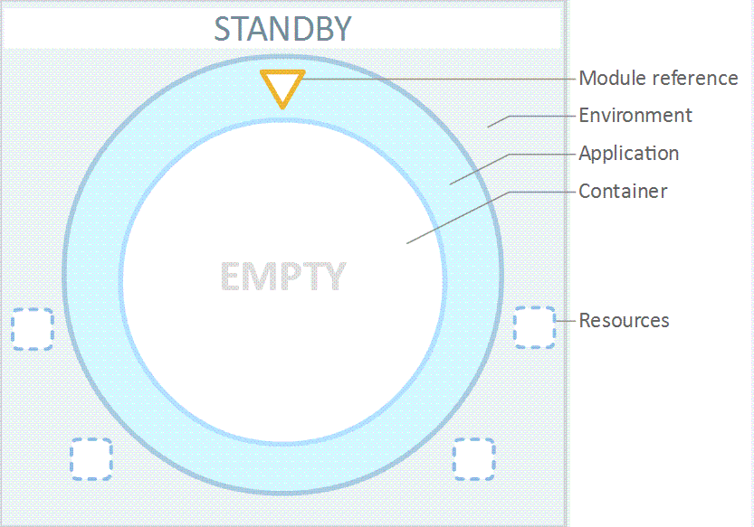
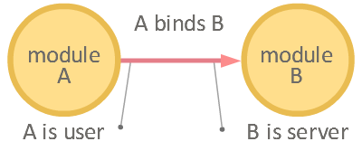
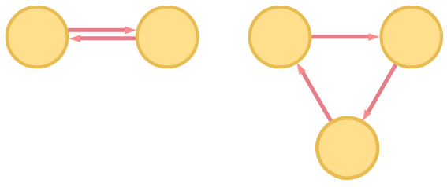
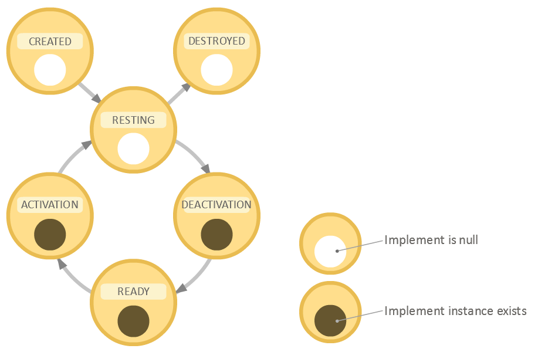
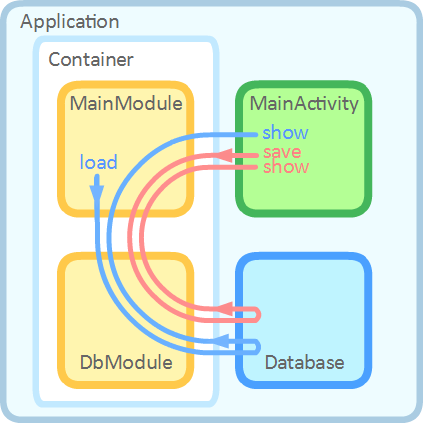

**Modularity** is a modular Android application design framework that provides:
- Module lifecycle state management
- Module state-transparent communication
- Module resources optimization
- Module dependency management
- Module dependency injection

## Content:  
- [Application design guidelines](#application-design-guidelines)
- [Application lifecycle](#application-lifecycle)
- [Module anatomy](#module-anatomy)
- [Module interrelations](#module-interrelations)
- [Module lifecycle](#module-lifecycle)
- [Dependency injection](#dependency-injection)
- [Testing](#testing)
- [Android integration](#android-integration)
- [Android example](#android-example)
- [Glossary](#glossary)
- [Installation](#installation)

## Quick example

In a simple scenario the framework can be used in the three simple steps:
1. Define a module that provides some service (an access to the database for example):  
	```kotlin
	class DBModule: Module<DBModule.Implement>() {
		fun saveData(data: String) = implement.runAsync { saveDataImpl(data) }
		override fun onCreateImplement(): Implement = Implement()
		
		inner class Implement: ModuleImplement {
			lateinit var connection: DummyDatabase
			fun saveDataImpl(data: String) = connection.save(data)
			suspend override fun SuspendUtils.onActivate(first: Boolean) {
				connection = DummyDatabase()
				waitUnless { connection.isOpen }
			}
			suspend override fun SuspendUtils.onDeactivate(last: () -> Boolean) {
				connection.close()
				waitWhile { connection.isOpen }
			}
		}
	}
	```  
2. Define a module that uses the service:  
	```kotlin
	class MainModule: BaseModule() {
		val db: DBModule = bind(DBModule::class)
		fun saveData(data: String) = db.saveData(data)
	}
	```  
3. Obtain a user module reference to start, use, and then stop the module:  
	```kotlin
	val container = ModuleContainer()
	val ref = container.moduleReference(MainModule::class)
	val module = ref.bindModule()
	module.saveData("Hello, world") // prints: Hello, world is saved.
	ref.unbindModule()
	
	// The dummy implementation of the database:
	class DummyDatabase {
		init { thread { Thread.sleep(1000); isOpen = true } }
		var isOpen: Boolean = false
		fun close() { isOpen = false }
		fun save(data: String) {println("$data is saved.")}
	}
	```


## Application design guidelines

1. **Distribute areas of the application functionality among modules.**  
A module is a building block of the application that performs specific part of the application’s functionality.  
Application modules form a directed graph of dependencies with one or more source (top-level) vertices.   
Cyclic dependencies are permitted but discouraged and can be resolved with feedback channels.  A usual example can contain one “main” (top-level) module coordinating modules responsible for key areas of functionality (1st level), which in their turn are using different utility modules (2nd level).   
Modules that have no inbound dependencies and only coordinate or use other modules (top-level alike) can be subclasses of `BaseModule`. Whereas modules that are used by other modules and/or have non-trivial lifecycle (long initialization or restful) can extend the `Module` class. Modules that can have more than one implementation (like release and test) might consider extending `Module` class too.  

	Good module candidate:
	- initializes, coordinates or uses other modules
	- offers some functionality to different objects (service)
	- needs to be informed if it’s of no interest anymore and should run some cleanup
	- has substantial initialization time and wants to make it transparent for a user
	- has “restful” lifecycle (recreated on demand, destroyed on idle) and wants to make it transparent for a user
	- consumes a substantial amount of resources or depends on some external resource that can be temporarily unavailable, so it can have “restful” lifecycle   
	
	Bad module candidate:  
	- has instant initialization and low resource consumption (data object)
	- is used inside the only object  
	
2. **For each module, design its communication interface with related modules and its implementation.**
Subclasses of the `BaseModule` have their interface and implementation integrated. Whereas `Module` subclasses have their implementation encapsulated in a separate class.

## Application lifecycle

1. **Standby**: The fundamental entity of an application is the module container (ModuleContainer class) which manages the creation and access to modules. As soon as the application is created, a container instance should be created too.  
The entry point to the application is the container’s `moduleReference` method returning a `ModuleReference` instance which allows access the target module from outside of the container. It’s lightweight unless it binds the target module.   
2. **Starting**: When the application receives a request to start, the `bind` method of a “main” (top level) module reference should be called. (The module instance returned from this call can be used right away).  
After this but before any module is created, the container’s `onPopulated` callback is invoked.   
During its creation, the “main” module binds related modules. They, in the same way, bind theirs. And so on until the application structure is fully initialized.
3. **Operating**: Meanwhile, the application is serving its purpose. …   
Note, there is no special event when the operating phase is started because actual operating begins since a construction of the first module.
4. **Finishing**: When the application receives a request to finish, the “main” module reference’s `unbind` method has to be called.  
Once it’s done, the “main” module’s deactivation process starts. Upon its completion, the module automatically unbinds its related modules. They, in the same way, unbind theirs. And so on until the last module is removed from the container.   
At this moment the container’s `onEmpty` callback is invoked.   
Since then the application can exit the process or wait for the next request to start (back to Standby phase).  

**Quick recap:**   
- To start the application get a top-level module reference, and call its `bind` method
- To finish the application call the reference’s `unbind` method and intercept the finish completion in container's `onEmpty` callback.  

     
_App lifecycle_


## Module anatomy

There are two basic types of modules:  
- The one represented by `BaseModule` class, which is a light version without the lifecycle management support.
- And the one represented by `Module<IMPLEMENT: ModuleImplement>` class, featured with the lifecycle management, which is discussed hereafter.  
A `Module` class separates the implementation of its functionality from the interface. The implementation is encapsulated in the `ModuleImplement` subclass specified as its type parameter, while the `Module` class itself acts as the interface. **Such separation allows the module to remain lightweight and create an instance of the implement on demand.  (Resource optimization feature). It also facilitates “one interface, multiple implementations” design used with dependency injection feature.**  
Since the implement is not always available and ready to execute calls, those calls would have to be synchronized with its state. To eliminate this complication, the module isolates the implement from direct access and instead provides the implement accessor (`ImplementAccessor` class) which makes communication with the implement state-transparent. **I.e. the implement can be called via the accessor anytime, no matter what state the implement is currently in.   
The accessor guarantees a caller to deliver a request to the implement the moment it’s ready to execute it. (State-transparency feature).**  
`ModuleImplement` class also supports asynchronous activation and deactivation. So, in addition, **the accessor guarantees the implement to call it only while it’s ready to execute calls. I.e. no earlier than its activation is finished, and no later than its deactivation is started.  (State management feature).**  
The type of the implement is declared in the module type parameter: `Module<T: ModuleImplement>`. And when new implement is required, it’s requested from the module’s `onCreateImplement(): T` callback. In fact, the module can implement it by itself. Or even return instances of different subclasses of `T` depending on the circumstances.   
   


### Implement accessor usage

The module’s `implement` property presents the implement accessor and provides the following methods to access the implement (the `IMPLEMENT` is a type of the implement).   
- `inline fun <T> runIfReady(code: IMPLEMENT.() -> T): Result<T>`  
Synchronously runs the `code` and returns a successful result if the module is ready (see module lifecycle) or a failed result otherwise.   
- `fun <T> runAsync(code: suspend IMPLEMENT.() -> T): AsyncResult<T>`  
Queues the `code` request. If the module is ready, the request is executed immediately. Otherwise, it triggers the module activation and will be executed as soon as the module is ready.  
- `suspend fun <T> runSuspend(code: suspend IMPLEMENT.() -> T): Result<T>`  
The same as `runAsync` except this suspend call runs in the context of some coroutine.  

### Implement thread context

Asynchronous requests run in thread(s) managed by the implement’s thread context.   
A thread context (`ThreadContext` class) can be configured to run requests in specified thread(s) sequentially or in parallel.  
By default the implement’s thread context is `null`, that is, if the implement is ready, a request runs in the caller’s thread, otherwise it’s scheduled and will run in CONTAINER context.  
The implement’s thread context can be overridden in module’s `onCreateThreadContext` callback to return:   
- a custom implementation of the `ThreadContext` 
- one of the container’s `ThreadContexts`:   
	- CONTAINER: a single-threaded instance shared among all users including the container itself. Can be overridden in container’s `onCreateThreadContext` callback  
	- MONO: individual single-threaded instance  
	- MULTI: individual configurable pool  
	
The current context can be obtained from `implement.threadContext`.   

**Quick recap:** 
- Implement encapsulates all the module functionality;
- Module maintains communication interface between the implement and related modules;
- Implement accessor makes this communication state-transparent.


## Module interrelations

A module is uniquely identified within the container by the combination of its class and its optional `bindID`. This combination is used for module lookup. And other modules use it to bind this module. Furthermore, the `bindID` is accessible since the beginning of module construction so it can be used for initialization.  
One module binds another for the purpose of its use. So in this relation, the first is a user and the second is a server.  
   

**A server module guarantees a user that it will stay alive and serve while it’s bound by the user. I.e. the module serves as long as the user holds it.**   

There are two types of module binding:  
- **External**: a top-level module is bound via module reference (`ModuleReference` class)  which can be obtained from the container's `moduleReference` method. Then the reference's `bindModule` method can be called: 
	``` kotlin
	val ref = container.moduleReference(SomeModule::class)
	val module = ref.bindModule()
	```  
	Top-level modules are entry points to the application. They initialize and coordinate other modules.   
	**Module bound this way should be unbound explicitly, by calling reference's `unbindModule` method.**  
- **Internal**: one module can bind another by calling its `bind` method:  
	``` kotlin
	val anotherModule = bind(AnotherModule::class)
	```  
	The module can unbind another module explicitly by calling its `unbind` method. Although it’s optional since this type of binding is managed by the framework. **The module automatically unbinds all the modules it bound (servers) when no other modules bind it (users). I.e. if nothing holds the module, it releases all it holds.  (Dependency management feature).**  

### Cyclic dependency

There are situations when two modules should use each other. And the obvious solution is for them to bind each other. But this causes a cyclic dependency.  
   

A cyclic dependency occurs when two modules bind each other directly or indirectly. It can not be managed by the framework and requires one of the modules to unbind the other explicitly. To ensure no unintended cyclic dependencies, the module’s `bind` method has the parameter `allowCyclicBinding` which is `false` by default. And if it’s `false` and a cyclic dependency is detected the method throws an exception.   
The alternative solution to a cyclic dependency is a feedback channel. 

### Feedback channel

It suits a situation when a container needs to talk to modules or a module needs to talk to its users. Communication via a feedback channel takes the following steps:  
- Create a feedback class that suits the need:
	``` kotlin
	class SomeEvent(name: String)
	```  
- Create a listener interface that handles such feedbacks:
	``` kotlin
	interface SomeListener {
		fun handle(event: SomeEvent)
	}
	```  
- Implement the listener by the receiver module:
	``` kotlin
	class ModuleA: Module<...>(), SomeListener {
		override fun handle(event: SomeEvent) = println("Got event from $name")
	}
	```  
- Create a channel in the sender (container or module) passing it the handler callback. Then use it at runtime to deliver feedback to listeners:
	``` kotlin
	class ModuleB: Module<...>() {
		val eventChannel = feedbackChannel(SomeListener::handle)
		fun talkToSomeListener() = eventChannel(SomeEvent(“ModuleB”))
	}
	```  

In fact, nothing stops from using the feedback mechanism for more complex call-response interactions.

## Module lifecycle

A module is alive as long as it has users, i.e. the module is created when the first module binds it and is destroyed after none of the modules binds it. In between these two events, the module is alive and ready to serve.   
The lifecycle of a `BaseModule` successor is simple. It’s alive until it’s unbound whereupon it’s destroyed and removed from the container.  
A `Module` successor during its lifecycle internally passes through the following states:   
   

- **CREATED**:
At this state, the module is created and added to the container.  
After the constructor is called it receives `onConstructed` callback. The constructor and callback are the proper places for basic module activation. E.g. binding related modules.   
In case if the current instance of the module is created during the destruction of the previous instance, the current one will wait until the latter is finally destroyed and removed from the container.    
- **RESTING**: 
It’s where an implement instance does not yet exist (is null). The module rests and waits to enter the next state until one of the following happens (considering it’s bound and enabled):   
	- it’s restless;
	- it’s restful and there is a request to it;
	- the above holds true for its user that bound it with keepReady=true;
	- it’s unbound and it didn’t pass the last deactivation (final approach);     
	
	Otherwise, if the module is unbound it enters the DESTROYED state.  
- **ACTIVATING**: 
The module’s `onCreateImplement` callback is invoked and should return an implement instance. It can be a new instance or the reference to the module itself if it acts as its own implement. Here the module can pass any data required by the newly created implement. And then the implement’s `suspend fun SuspendUtils.onActivate(first)` callback is invoked. The suspension runs in the thread of the caller, although the `SuspendUtils` receiver can switch the thread context. The activation finishes as soon as the callback returns from its suspension. If this is the first activation pass the `first` param is true.   
- **READY**: 
It’s where the implement actually operates. Firstly it executes requests queued by the accessor before. Then it keeps processing incoming requests until one of the following happens:  
	- it’s restful, hasn’t been having requests (i.e. idle) during the specified (in restDelay) time, and all the users bound with `keepReady=true` are resting; 
	- it’s disabled;  
	- it has been unbound and has no requests;  
	
	The module’s property `isReady` indicates if the module is currently in READY state.  
- **DEACTIVATING**: 
The implement’s `suspend fun SuspendUtils.onDeactivate(last)` callback is invoked. The suspension runs in the thread of the caller, although the `SuspendUtils` receiver can switch the thread context. The deactivation finishes as soon as the callback returns from its suspension. Then the current instance of implement is set to null and the module enters the RESTING state again.   
The restful module can circulate inside the RESTING - READY loop until it’s destroyed. If this is the final deactivation pass before the destruction the `last` param is true. The framework guarantees the final deactivation so that the implement could do the proper self-cleanup.   
From the final deactivation, the module is considered unavailable, the implement accessor rejects requests, and if a new instance of the module is created it waits until this instance is destroyed. 
- **DESTROYED** :  
It’s where the module’s `onDestroyed` callback is invoked and it’s removed from the container. The module is no more alive.
The property `isAlive` indicates if the module is currently alive or destroyed.  

### Controlling the module behavior:

Except for the two natural factors that define module behavior (binding and requesting a module), there are three more:  
- **Setting a module restful / restless:** 
A module is restless by default which means it stays READY even if it doesn’t do anything at the moment. Setting a module restful is a way to conserve system resources by deactivating it after some specified idle time. It can be done by calling module’s `setRestful` method. Where `restDelay` parameter specifies the delay between the last finished request and the moment the module starts deactivation. Any new request will initialize the module again.   
The module’s `setRestless` can be called to return to default behavior.   
The current state can be checked with the `isRestful` property.  
TODO about RestCalculator  
- **Keeping a server ready:** 
The option is available as the parameter of the method `bind`. In this case, the server can additionally guarantee its user to stay READY all the way the user is not RESTING. This allows the user to communicate with this module synchronously. However, this prevents the restful module from going rest.   
- **Setting a module enabled / disabled:** 
In case a module is unable to operate properly it can be disabled. That forces it to deactivate and stay resting.  All the further requests will be rejected, i.e. return an exception.   
A module is also disabled by the framework in case it throws an exception during its creation, creation of its implement, activation or deactivation. If one of these happens the exception will be propagated to the `onUnhandledError` method of the `DebugInfo` class which can be overridden by extending it and assigning its instance to the `debugInfo` property of the module.    
Enabling a module puts it back on the regular course of actions.   
In case of enabling / disabling a module, all its users are informed about it by receiving the `onBoundModuleDisability` callback.
To disable a module call its `disable` method. To enable, it call `enable` method.   
The current state can be checked with the `isEnabled` property.  

## Dependency injection

The framework supports the late binding that allows instantiating module classes depending on a runtime configuration. That is, a user, when binding, can specify not the concrete class of the server it wants to bind, but the “interface” class. The configuration code associates “interface” class with a version of concrete class depending on the specific purpose (e.g. release or test version).   
Example:   
- Define the server “interface” class:
```kotlin
abstract class BaseServer: Module<BaseServer>(), ModuleImplement  {
	abstract fun perform()
}
```
- Define the "test" version:
```kotlin
class TestServer : BaseServer(), ModuleImplement {
	override fun perform() = println("Test")
}
```
- Define the "release" version:
```kotlin
class ReleaseServer : BaseServer(), ModuleImplement {
	override fun perform() = println("Release")
}
```
- Configure the association:
```kotlin
class Container: ModuleContainer() {
	init {
		val injectKlas = if (isDebug) TestServer::class else ReleaseServer::class
		associate(BaseServer::class, injectKlas)
	}
}
```
- Bind and use the “interface” module:
```kotlin
class User : Module<User>(), ModuleImplement {
	val server = bind(BaseServer::class)
	fun use() = server.perform()// prints "Test" or "Release" depending on isDebug
}
```  

## Testing

Both the `ModuleContainer` and `Module` classes have their open inner `DebugInfo` class which contains some helpful debug information. And also they have the ‘debugInfo’ property to which an instance of that class can be assigned. This property is meant to be used solely for debugging purpose. And its value should depend on whether a debug or release version is currently running:  
`override val debugInfo = if (DEBUG) DebugInfo() else null`  

## Android integration

The framework has Android-specific extensions to core classes which facilitate the development of Android applications.  
The `AndroidBaseModule` and `AndroidModule` are Android extensions of the `BaseModule` and `Module` respectively. They have their `container` property cast to the `AndroidContainer` which represents a module container for the Android application.  

`AndroidContainer` in its turn has some useful features:  
- The `appContext` property references the current application context.
- The `uiContext` property references the current `Activity` if any.
- The `ThreadContexts` has the `MAIN` thread context that executes requests in the app’s main thread.  
- `onUiPhaseChange` callback allows to track the most general UI events (i.e. Activity state transitions not counting configuration changes):  
	- CREATED: The app has just acquired the UI (the first activity created);
	- SHOWN: The UI has become visible to a user (the first activity resumed);
	- HIDDEN: The UI has become invisible to a user (the last activity stopped);
	- DESTROYED: The app has just lost the UI (the last activity destroyed);  

The `UIModule` is designed to deal with UI. Its `ActivityReference` method is used for declaring a delegate property of target `Activity` type. Like so:  'val mainUi: MainActivity? by ActivityReference()'.  

Also, the thread context of the `UiModule`’s implement is `container.ThreadContexts.MAIN` which executes implement requests in the app’s UI thread.   

The `UIModule`’s counterpart is the `UiModuleReference` interface that can be implemented by an `Activity` to deal with an `UiModule` by declaring a target module access property. Like so:  
`val module: M = bindModule(this, M::class)`  

**FloatService**  
The `FloatService` is Android service that starts in case if the container still has running modules but the app’s activity has gone to background. By doing so it keeps the application process afloat, i.e. indicates to the Android system that the app is still running and should not be killed.  
Also, the `FloatService` serves for switching app to the foreground that increases its process priority. The `startForeground` and `stopForeground` methods of a container control this behavior.  
The `FloatService` is registered in the library's AndroidManifest and merged into the host app's manifest:  

## Android example

This example demonstrates basic principles of using the framework in an Android app.  
This demo app does two things:
- On app start loads some data from an emulated database and shows  it in the UI.
- On a UI "save" button click saves data in the database giving a feedback.  

   

```kotlin
// Instantiate the `AndroidContainer` subclass in `onCreate` method
// of the `android.app.Application` subclass (do not forget to register it in the `AndroidManifest.xml`).

class App: Application() {
	override fun onCreate() {
		Container(this)
	}
}

class Container(app: App): AndroidContainer(app) {
	val ref = moduleReference(MainModule::class)
	
	// Here we use the app's Activity first launch to start the "main" module,
	// and an Activity exit to stop the "main" module.
	override fun onUiPhaseChange(phase: UiPhase) {
		if (phase == UiPhase.CREATED) ref.bindModule()
		else if (phase == UiPhase.DESTROYED) ref.unbindModule()
	}
	
	// The actual completion of any module activity is intercepted here.
	override fun onContainerEmpty() {
		Log.i("Container", "Container is empty")
	}
}

// The basic role of a "main" module is to initialize and coordinate other modules.
// Here the "main" module, in addition, handles the communication with UI.

class MainModule: UIModule<MainModule.Implement>() {
	val db: DBModule = bind(DBModule::class)
	val ui: MainActivity? by ActivityReference()
	
	fun loadData() {
		implement.runAsync { loadDataImpl() }
		  .onComplete { result -> ui?.showMessage(result.valueOrThrow) }
	}
	
	fun saveData(data: String): AsyncResult<Boolean> = implement.runAsync { saveDataImpl(data) }
	
	override fun onConstructed() = loadData()
	
	override fun onCreateImplement() = Implement()
	
	inner class Implement: ModuleImplement {
		suspend override fun SuspendUtils.onActivate(first: Boolean) {}
		suspend override fun SuspendUtils.onDeactivate(last: () -> Boolean) {}
		
		suspend fun loadDataImpl(): String = db.loadData().valueOrThrow
		
		suspend fun saveDataImpl(data: String): Boolean = db.saveData(data).valueOrThrow
	}
}

// This module imitates interactions with a database.
// All implement's actions are performed in a separate thread as defined by the overridden thread context.

class DBModule: AndroidModule<DBModule.Implement>() {
	suspend fun loadData(): Result<String> = implement.runSuspend { loadDataImpl() }.flatten()
	
	suspend fun saveData(data: String): Result<Boolean> = implement.runSuspend { saveDataImpl(data) }.flatten()
	
	override fun onCreateImplement(): Implement = Implement()
	
	override fun onCreateThreadContext(): ThreadContext? = container.ThreadContexts.MONO(this)
	
	inner class Implement: ModuleImplement {
		lateinit var connection: DummyDatabase
		
		suspend override fun SuspendUtils.onActivate(first: Boolean) {
			connection = DummyDatabase()
			waitUnless { connection.isOpen }
		}
		
		suspend override fun SuspendUtils.onDeactivate(last: () -> Boolean) {
			connection.close()
			waitWhile { connection.isOpen }
		}
		
		suspend fun loadDataImpl(): Result<String> = connection.load()
		
		suspend fun saveDataImpl(data: String): Result<Boolean> = connection.save(data)
	}
}

// This class simulates database with long-running initialization and operations.

class DummyDatabase {
	var isOpen: Boolean = false
	
	init {
		thread {
			Log.i("db", "Initializing")
			Thread.sleep(1000)
			Log.i("db", "Initialized")
			isOpen = true
		}
	}
	
	fun close() {
		isOpen = false
	}
	
	suspend fun load(): Result<String> = SuspendTask {
		Log.i("db", "Loading data.")
		Thread.sleep(1000)
		Log.i("db", "Loaded data.")
		"Initial data loaded"
	}
	
	suspend fun save(data: String): Result<Boolean> = SuspendTask {
		Log.i("db", "Saving data.")
		Thread.sleep(1000)
		Log.i("db", "Saved data.")
		true
	}
}

// The Activity binds and interacts with the MainModule.

class MainActivity: Activity(), UiModuleReference<MainModule> {
	override val module = bindModule(this, MainModule::class)
	val message by lazy { findViewById<TextView>(R.id.message) }
	
	override fun onCreate(state: Bundle?) {
		super.onCreate(state)
		setContentView(R.layout.activity_example)
		findViewById<Button>(R.id.button).setOnClickListener { saveMessage() }
	}
	
	fun saveMessage() {
		val data = message.text.toString()
		message.text = ""
		module.saveData(data)
		  // `module.ui` returns a fresh instance of this Activity avoiding leakage
		  .onComplete { module.ui?.showMessage("Message is saved") }
	}
	
	fun showMessage(text: String) = runOnUiThread {
		message.text = text
		Log.i("ui", "Message:  $text")
	}
}
```

TODO ## Glossary
User
Server
container
module
Implement
accessor
thread context
reference

TODO ## Installation
TODO Proguard notes